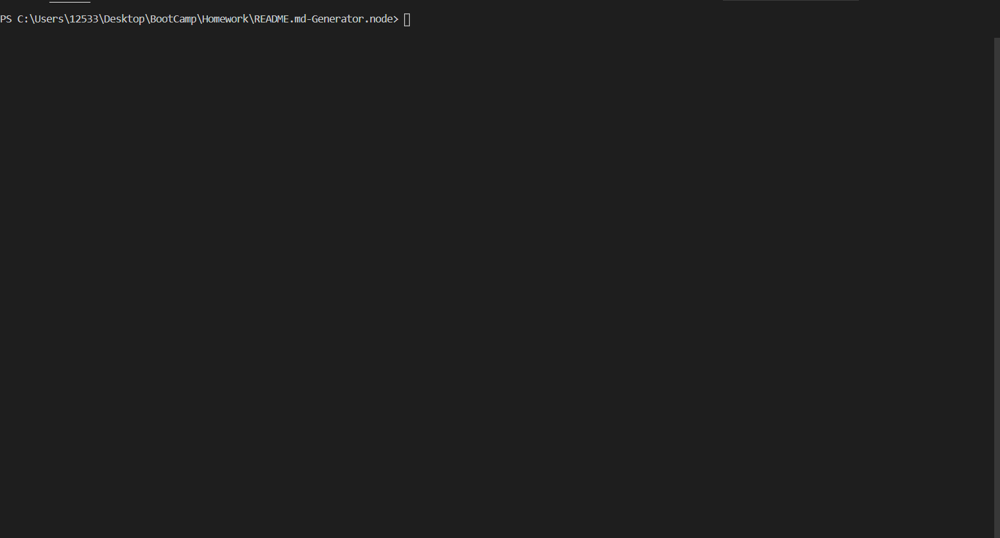

# README-Generator.Node

## LINK TO DEPLOYED VERSION --> https://adambear1.github.io/README.md-Generator.node/

## Features
### Libraries
* Inquirer.
* Axios.
* Util.
* Dedent.
* Fs.

### Asynchronousity
* .then()
* Promisify
* Util

## Languages Used
* Node JS

## Total Usage
* A complete back end, Command Line Interface (CLI) used by programmer to automatically fill templated MarkDown File to generate a README.
* Uses Github API to pull users information for profile picture, as well as to create links to repo through shields (if username and project name are stored correctly).
* Extremely lightweight on backend and thorough, clean code to easily debug if errors arise.